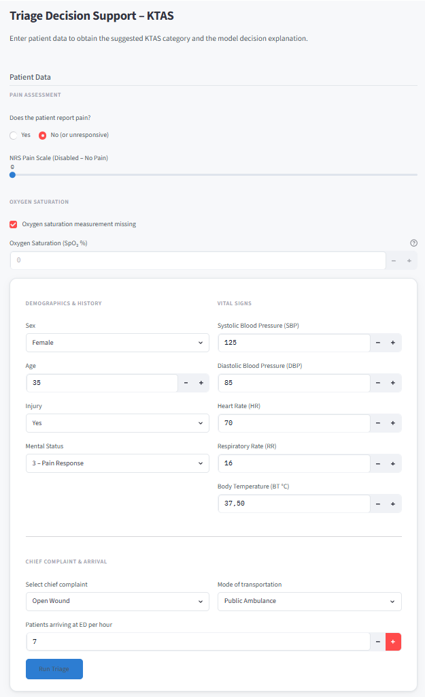
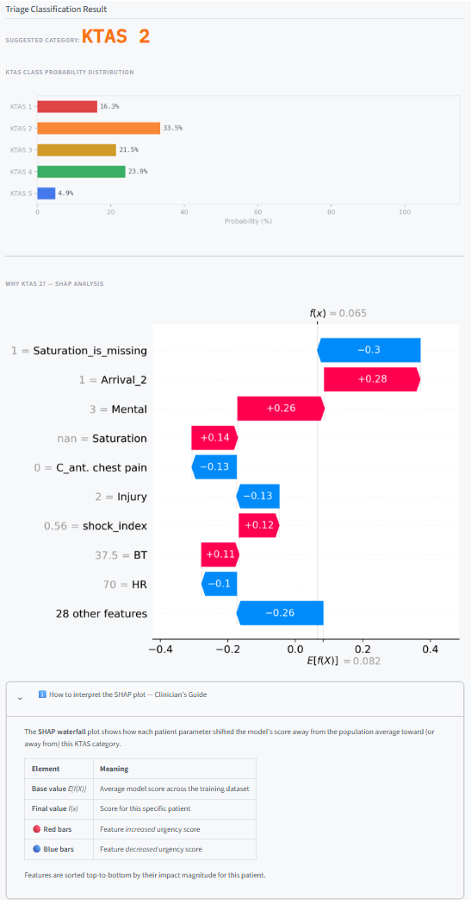

# KTAS Triage Decision Support System

A clinical decision support tool that predicts Korean Triage and Acuity Scale (KTAS) triage levels from patient vitals and chief complaints, with per-patient explainability via SHAP.

> **Disclaimer:** This system is intended as a decision support aid only. The final triage category assignment remains the sole responsibility of the attending clinician.

---

## Overview

Emergency department triage is a high-stakes, time-pressured task. Systematic under-triage of critically ill patients (KTAS 1–2) is a known risk. This project builds a machine learning classifier trained on real ED data to assist nurses in assigning KTAS levels, and surfaces the reasoning behind each prediction using SHAP waterfall plots.

The model is deployed as an interactive Streamlit web application.

---

## Project Structure

```
├── triage_app.py        # Streamlit application
├── style.css            # External stylesheet
├── model.ipynb          # Data analysis, feature engineering, model training
├── final_model.pkl      # Trained VotingClassifier (RF + XGBoost)
└── data.csv             # Source dataset (not included in repo)
```

---

## Dataset

- **Source:** [Emergency Service Triage Application – Kaggle](https://www.kaggle.com/datasets/ilkeryildiz/emergency-service-triage-application)
- **Size:** 1,266 patients (after cleaning), 35 features
- **Target:** `KTAS_expert` — triage level assigned by an expert (1–5)

### KTAS Levels

| Level | Name | Time Objective |
|---|---|---|
| 1 | Resuscitation | Immediate |
| 2 | Emergent | Within 30 min |
| 3 | Urgent | Within 60 min |
| 4 | Less Urgent | Within 90 min |
| 5 | Non-urgent | Within 120 min |

### Class Imbalance

The dataset is heavily skewed — KTAS 1 patients represent only ~2% of cases, while KTAS 3–4 account for ~75%. SMOTE (Synthetic Minority Over-sampling Technique) was applied to the training set to ensure the model learns to recognize rare critical cases.

---

## Methodology

### 1. Data Leakage Prevention

Columns unavailable at triage time were removed before training: `Diagnosis in ED`, `Disposition`, `KTAS_RN`, `Error_group`, `mistriage`, `Length of stay_min`, `KTAS duration_min`.

### 2. Preprocessing

- **Chief complaint:** Top 10 most frequent values kept; all others merged into `Other`. One-hot encoded.
- **Arrival mode:** Values 5, 6, 7 merged into a single `Other` category. One-hot encoded.
- **Missing vitals (SBP, DBP, HR, RR, BT):** Replaced with median (28–29 cases each).
- **Saturation:** 697 missing values → new binary flag `Saturation_is_missing` added; raw value filled with median.
- **NRS pain:** 556 missing values → new binary flag `pain_unmeasurable` (for unresponsive patients where pain couldn't be assessed); remaining NRS = 0 for Pain = 0 cases.

### 3. Feature Engineering

Eight clinically motivated binary and continuous features derived from vitals:

| Feature | Definition |
|---|---|
| `is_hypotensive` | SBP < 90 or DBP < 60 |
| `is_hypertensive` | SBP > 140 or DBP > 90 |
| `has_fever` | BT > 38.0 °C |
| `low_oxygen` | SpO₂ < 94% |
| `tachycardia` | HR > 100 bpm |
| `bradycardia` | HR < 60 bpm |
| `shock_index` | HR / SBP |
| `map` | (SBP + 2 × DBP) / 3 |

### 4. Model

A **soft-voting ensemble** of two complementary algorithms:

- **Random Forest** (`n_estimators=300, max_depth=10`) — discovers general rules, robust to noise
- **XGBoost** (`n_estimators=100, learning_rate=0.1, max_depth=5`) — corrects residual errors sequentially, captures non-linear interactions

Combining both reduces single-model error and improves calibration of class probabilities.

---

## Performance

Evaluated on a held-out 20% stratified test set.

| Metric | Value |
|---|---|
| Accuracy | 66% |
| Balanced Accuracy | 62.7% |
| Macro F1 | 0.62 |
| Weighted F1 | 0.66 |
| Critical under-triage rate | 14.3% |

**Critical under-triage** (KTAS 1–2 patient assigned KTAS 4–5) occurred in 14.3% of truly urgent cases — meaning 1 in 7 critically ill patients would receive delayed care if the model were used autonomously. This defines the system's role: **decision support, not autonomous triage**.

### Per-class notes

- **KTAS 1:** 80% recall — rare but the model catches 4 out of 5 critical cases
- **KTAS 2:** 52% recall — the weakest point; nearly half of emergent patients are under-triaged
- **KTAS 3–4:** ~70% precision and recall — acceptable performance on the majority classes
- **KTAS 5:** 27% precision — the model is conservative and prefers to over-triage rather than miss urgent cases

### Top predictive features

1. `pain_unmeasurable` (18.4%) — inability to assess pain signals altered consciousness
2. `Mental` (12.1%) — consciousness level is the strongest single vital sign
3. `C_ant. chest pain` (9.8%) — treated as potential cardiac event until ruled out
4. `Saturation_is_missing` (4.5%) — missingness itself is a clinical signal
5. `NRS_pain`, `is_hypertensive`, `Arrival_3` — supplementary vital and contextual signals

---

## Explainability (SHAP)

Each prediction is accompanied by a **SHAP waterfall plot** generated from the XGBoost component of the ensemble. The plot shows which patient features pushed the model's score up (red) or down (blue) relative to the population baseline, ranked by impact magnitude. This allows a clinician to immediately identify which data points drove a given classification.

---

## Application

### Requirements

```
streamlit
pandas
numpy
joblib
shap
matplotlib
xgboost
scikit-learn
```

Install:

```bash
pip install streamlit pandas numpy joblib shap matplotlib xgboost scikit-learn
```

### Running the app

Place `triage_app.py`, `style.css`, and `final_model.pkl` in the same directory, then:

```bash
streamlit run triage_app.py
```

### Input fields

The form collects the following at triage time:

- **Demographics:** sex, age
- **History:** injury present, mental status (1–4)
- **Vitals:** SBP, DBP, HR, RR, BT, SpO₂
- **Pain:** NRS scale (1–10), or marked as absent/unmeasurable
- **Chief complaint:** selected from 10 categories + Other
- **Arrival mode:** walking, public ambulance, private vehicle, private ambulance, other
- **ED load:** patients arriving per hour at admission time

### Output

- Predicted KTAS level (color-coded 1–5)
- Probability distribution across all five classes
- SHAP waterfall plot explaining the individual prediction

---

## Images 
<p align="center">
   
</p>
<p align="center">
   
</p>

---

## Limitations and Future Work

- **Critical under-triage (14.3%)** is the primary safety concern. Threshold calibration to minimize KTAS 1–2 misclassification should be the next development priority, at the acceptable cost of increased over-triage.
- **KTAS 2 recall (52%)** is below clinical safety thresholds for autonomous use.
- **Dataset size (1,266 patients)** is relatively small for a 5-class problem with significant imbalance. A larger multi-centre dataset would improve generalization.
- The model was trained on Korean ED data and may not generalize directly to other healthcare systems or patient populations.
- Deployment in a real clinical environment would require prospective validation and regulatory review.